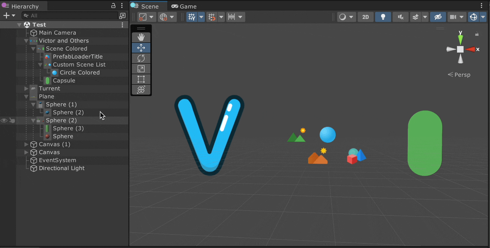

# VTools
 **Victor Toolkit** for Unity Game And Editor Development
 
 [](https://unity3d.com/get-unity/download)
 [](https://github.com/VictorHHT/VTools/blob/main/LICENSE)

<p align="center"></p>

## VTCustomPreview 
**VTCustomPreview** enhances your scene workflow by providing you with an **interactive preview** window for every object in the hierarchy. 
* **Fully Featured:** Support rotating, zooming, and panning of the camera. Utilize tweens and smooth functions to offer the best possible interactive experience.
* **Functional and Fluid:** Featuring quick left, front, top views with a click of a button, scene brightness adjustment, and reset functionality, along with multi-stage animations.
* **Automatic Calculation:** Automatically calculate the preview camera distance and position to encompass all objects in the preview.
* **Support Majority of Objects:** Work for almost all objects with a renderer (Mesh Renderer, Skinned Mesh Renderer, Sprite Renderer) and UGUI items.

<p align="center"></p>

## VTRevealer 
**VTRevealer** simplifies the process of selecting a specific object from a group of overlapping ones. Pressing Cmd/Ctrl + Shift + Right Mouse Button on the line of sight in the scene view, and all the overlapping objects in that line will be listed in the window, allowing you to select and focus on the one you want. 
* **Support All Objects:** Supports all visible objects in the scene, including models, sprites, and even objects with only icons but no renderer, such as Main Camera, Directional Light, etc.
* **Separated List:** The picked GameObjects and UI elements are displayed in separate lists, sorted based on distance (for GameObjects) or rendering order on the Canvas (for UI).
* **Outline Transition:** Smoothly transition from the outline of one object to another's position and size using VTEditorTween.


## VTHierarchy
Elevate Unity hierarchy clarity with alternating row shading, intuitive foldouts, and clear object indentations for a more organized and efficient workflow. Selecting objects at the same hierarchy level under the same parent can also be done through the right-click menu.
<p align="center"></p>

## VTSceneLoader 
**VTSceneLoader** centralizes scene management and loading, allowing you to categorize scenes with tags, easily add scenes to the custom list, access additional features through the "Three Dot" menu in the upper right corner, and customize icon order in ProjectSettings/VTSceneLoader.
* **Custom Scene List:** Assign icon and color to a tag in the custom scene list.
* **Easy Addition:** Add scenes by choosing from the selection popup or dragging a scene asset directly to the "Custom Scene List" title.
* **Copy & Paste:** You can copy the color and icon of a tag and paste on other tags.
* **Fuzzy Search:** Use fuzzy match algorithm to filter scenes with accuracy, efficiency and speed.
* **Build Settings Integration:** Specify whether to add multiple custom scenes to build settings by simply dragging.
* **Custom Icons:** Add custom icons to the project folder and customize their order in ProjectSettings/VTSceneLoader.
* **Automatic Saving:** The custom scene list is saved after assembly reload, and manual saving is available with the "Save" button.

<p align="center"></p>

## VTPrefabLoader
**VTPrefabLoader** provides you with a place to hold and manage the prefabs that you care about the most. You can add them by choosing one from the selection popup or by dragging a bunch of them to the title of the secondary reorderablelist directly. You can also drag from the preview icon of the prefab to the scene to add them quickly.
* **Nested Reorderable List:** Outer lists are for categorization, and inner lists are for storing prefabs under each category.
* **Drag & Drop:** You can drag from the preview image directly to **Scene View**, **Hierarchy** and **Project Browser** to create **instance** of the object or a **prefab** out of it.
* **Automatic Saving:** Similar to VTSceneLoader.

<p align="center"></p>

## VTHighlighter
**VTHighlighter** An easy to use and customizable scene object highlighter, allowing you to highlight scene objects super easily!
* **Simultaneous Highlight:** You can employ multiple VTHighlighter instances, each tailored to highlight objects in distinct ways, such as root object color, children color, fade-in and out tweens, and more. This allows you to highlight multiple scene objects in diverse ways simultaneously without being restricted to single Command Buffer or highlight material.
* **Advanced Tweening:** Each tween will start with the duration relative to the playing progress of previously interrupted tween, and the tween will not start playing if another one of the same kind(FadeIn or FadeOut) is playing, preventing a sudden change in fading effect from occuring.

<p align="center"></p>

```C#
// Typical use case:
// 1: Create a static VTHighlighter reference in the Type it belongs to 
private static VTHighlighter s_Highlighter;

// 2: Create an instance and store it in OnEnable or the constructor if null
if (s_Highlighter == null)
{
    s_Highlighter = new VTHighlighter();
    // You can also change its settings here
    s_Highlighter.fadeInDuration = 0.2f;
    s_Highlighter.fadeOutEaseType = EditorTween.EaseType.EaseOutQuad;
    s_Highlighter.autoRemove = false;
}

// 3: Highlight the scene object by providing the GameObject reference as the argument
s_Highlighter.HighlightSceneObject(objTransform.gameObject);

// 4: Remove the highlight with also one line
s_Highlighter.RemoveHighlightedSceneObject(objTransform.gameObject);
```

## SnapToSurface
Allowing you to snap a 3D object with a renderer to the surface of other objects, making them touch each other. You can perform snap based on either the world axis or the local axis of the object. 

<p align="center"></p>

<p align="center"></p>

## VTEditorTween
An Editor tween library built for **simplicity**, **flexibility** and **extensibility**. 
* **Simplicity:** Easy to use, with concise syntax and employing the Fluent Builder design pattern. All Tween settings can be connected seamlessly through Extension Methods. The introduction of the VTweenConfig class eliminates the tedious process of copy-pasting, reducing the likelihood of errors when modifying settings at multiple places.
* **Flexibility:** It offers dozens of Extension Methods, allowing you to mold a tween into any desired form. It supports all common Ease Functions, and for specific functions like Ease Back, custom parameters can be provided to adjust the animation effect.
* **Extensibility:** Utilizing Generics, you can effortlessly expand to support a wider range of Tween types. It also allows defining multiple ways to Tween a particular type. For instance, with String Tween, you can choose to append characters from the left one by one or convert it to an int value and update it from the right in a clock-like manner until it matches the target String.

### Usage
```C#
// Create a tween with static method and chain modifications one after another. The first parameter is the variable to tween, second is the setter you construct for that variable and the third is the target value of the tween
VTweenCreator.TweenVector3(m_WindowSize, newSize => m_WindowSize = newSize, targetSize).SetDuration(0.65f).SetEaseType(EaseType.EaseOutBack).SetOvershootOrAmplitude(0.65f).OnValueChanged(editorWindow.Repaint);

// Store tween reference, you can only chain applier settings right after the tween is created, this rounds float tween result to a multiple of 0.1f
VTweenCore tween = VTweenCreator.TweenFloat(m_TagsSpacing, newSpacing => m_TagsSpacing = newSpacing, 0f).SetFloatApplierSettings(0.1f).SetDuration(0.75f).SetInitialDelay(0.15f).SetEaseType(EaseType.EaseInOutQuart);

// Create a tween config object, chain settings after it and attach it to multiple tweens to apply those settings without the extra work of copying and pasting
VTweenConfig hueTweenConfig = new VTweenConfig();
hueTweenConfig.SetPlayStyle(PlayStyle.Normal).SetInfinite(true);

m_ObjTitleColorHueTween = VTweenCreator.TweenFloat(m_ObjTitleColorHue, newH => m_ObjTitleColorHue = newH, 0f).SetConfig(hueTweenConfig).SetDuration(5f).SetEaseType(EaseType.EaseInOutCirc);
m_UITitleColorHueTween = VTweenCreator.TweenFloat(m_UITitleColorHue, newHue => m_UITitleColorHue = newHue, 1f).SetConfig(hueTweenConfig).SetDuration(7f).SetEaseType(EaseType.Linear);

// This is a working example used for reset the camera and lighting in VTCustomPreview
// Note: you may want to remove previous tween of a variable before starting a new one for it to avoid conflict
if (m_HasModelPreview)
{
    m_PanTween?.Remove();
    m_PanTween = VTweenCreator.TweenVector3(m_CurrentPanDelta, pan => m_CurrentPanDelta = pan, Vector3.zero).SetDuration(VTVector3.Approximately(m_CurrentPanDelta, Vector3.zero, 0.001f) ? 0f : 0.5f).OnComplete(() =>
    {
        m_DistanceTween?.Remove();
        m_DistanceTween = VTweenCreator.TweenFloat(m_CurrentZoomLevel, zoom => m_CurrentZoomLevel = zoom, 1).SetDuration(0.75f).OnValueChanged(() =>
        {
            m_TargetZoomLevel = m_CurrentZoomLevel;
        });

        m_RotTween?.Remove();
        m_RotTween = VTweenCreator.TweenQuaternion(m_CurrentRot, rot => m_CurrentRot = rot, new Vector3(30, 50, 0)).SetDuration(0.75f).OnValueChanged(() =>
        {
            m_RotAroundX = m_CurrentRot.eulerAngles.x;
            m_RotAroundY = m_CurrentRot.eulerAngles.y;
        });

        m_LightTween?.Remove();
        m_LightTween = VTweenCreator.TweenFloat(lightIntensity, intensity => lightIntensity = intensity, 0.8f).SetDuration(0.5f).OnValueChanged(Repaint);
    });
}
```

### Extension
``` C#
// VTEditorTween comes with a generic method to tween a string, allowing you to provide custom tween applier without the need to create multiple functions like TweenString, TweenStringAdvanced, TweenStringNiceLooking etc.
public static VTween<string, string, TApplier> TweenString<TApplier>(string stringToTween, Action<string> setter, string target) where TApplier : TweenApplier
{
    VTween<string, string, TApplier> tween = new VTween<string, string, TApplier>(setter, stringToTween, target);
    return tween;
}

// Here is another non-generic built-in method that tweens a quaternion with custom settings
public static VTween<Quaternion, Vector3, QuaternionV3Applier> TweenQuaternion(Quaternion quaternionToTween, Action<Quaternion> setter, Vector3 target)
{
    VTween<Quaternion, Vector3, QuaternionV3Applier> tween = new VTween<Quaternion, Vector3, QuaternionV3Applier>(setter, quaternionToTween.eulerAngles, target);
    tween.m_ApplierSettings = new QuaternionV3ApplierSettings();
    return tween;
}
```
